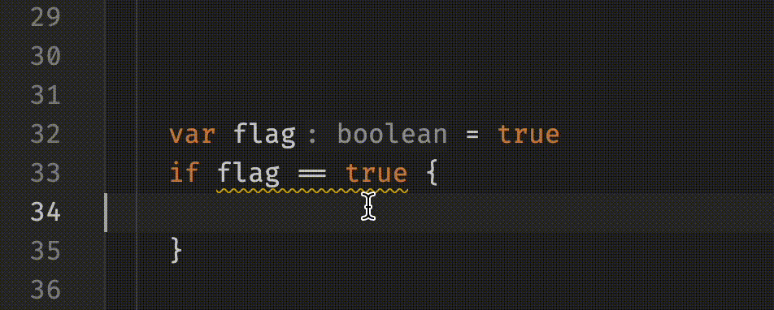

# Dyvil LSP

This project provides a compiler, Language Server Protocol (LSP) implementation, VSCode extension and web editor for the Dyvil programming language.

It was made as part of the Winter Term 2023/24 course "Software Tool Construction" at the University of Kassel.
The full course (in German) is available on [YouTube](https://www.youtube.com/playlist?list=PLohPa1TMsVqqhHYCDIzjl3roqRRNcndze).

The web editor is a single-page Angular application with the [Monaco Editor](https://microsoft.github.io/monaco-editor/).
It is available at [dyvil.org](https://dyvil.org).

## Screenshots

## Features

- Syntax highlighting and semantic tokens
- Validation/diagnostics
- Transpilation to JavaScript
- Editing
  - Code completion
  - Rename
  - Code formatting  
    
  - Code actions: specify type explicitly, simplify expression  
    
- Information
  - Show references, definition, type definition
  - Hover documentation
  - Document highlight
  - Document symbols  
    
  - Inlay hints (inferred type, parameter names)  
    

## Development

Run `nx serve web` for a dev server. Navigate to http://localhost:4200/. The app will automatically reload if you change any of the source files.

Run `nx graph` to see a diagram of the dependencies of the projects.
